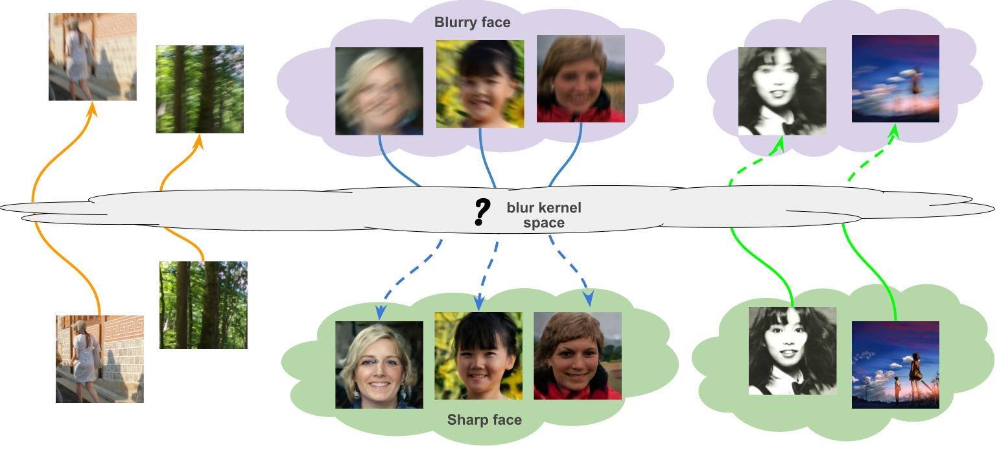
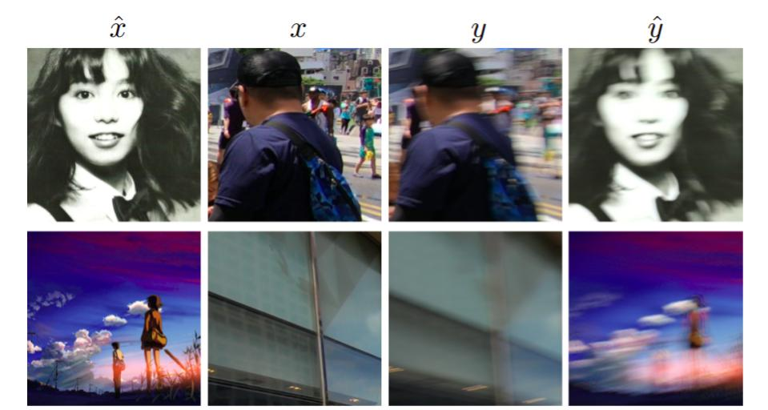
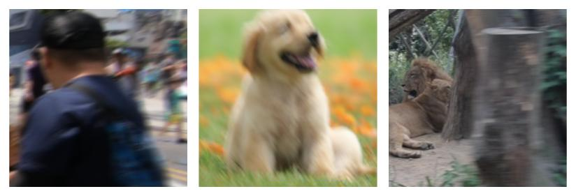
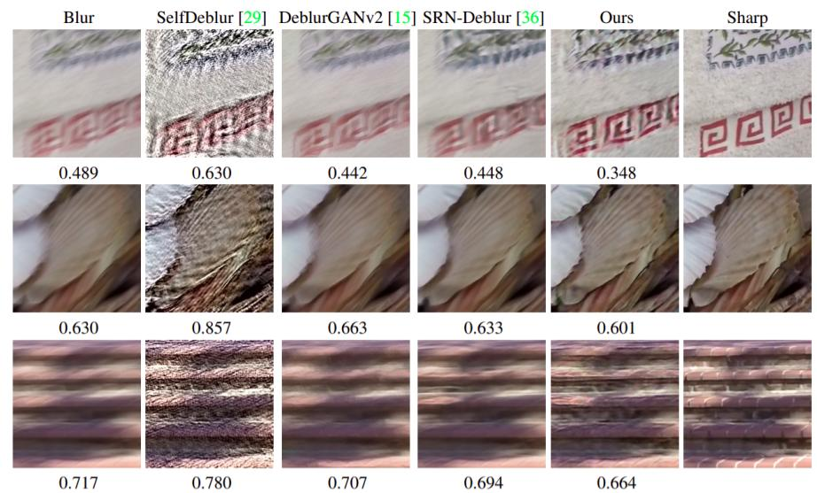
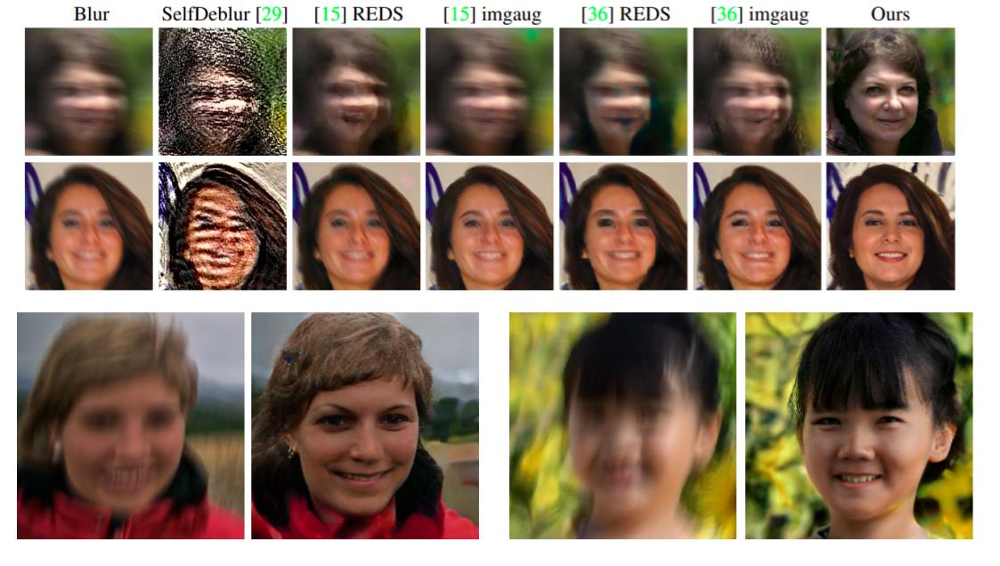

# Exploring Image Deblurring via Encoded Blur Kernel Space

## About the project

We introduce a method to encode the blur operators of an arbitrary dataset of sharp-blur image pairs into a blur kernel space. Assuming the encoded kernel space is close enough to in-the-wild blur operators, we propose an alternating optimization algorithm for blind image deblurring. It approximates an unseen blur operator by a kernel in the encoded space and searches for the corresponding sharp image. Due to the method's design, the encoded kernel space is fully differentiable, thus can be easily adopted in deep neural network models.



Detail of the method and experimental results can be found in [our following paper](https://arxiv.org/abs/2104.00317):
```
@inproceedings{m_Tran-etal-CVPR21, 
  author = {Phong Tran and Anh Tran and Quynh Phung and Minh Hoai}, 
  title = {Explore Image Deblurring via Encoded Blur Kernel Space}, 
  year = {2021}, 
  booktitle = {Proceedings of the {IEEE} Conference on Computer Vision and Pattern Recognition (CVPR)} 
}
```
Please CITE our paper whenever this repository is used to help produce published results or incorporated into other software.

## Table of Content 

* [About the Project](#about-the-project)
* [Getting Started](#getting-started)
  * [Prerequisites](#prerequisites)
  * [Installation](#installation)
  * [Using the pretrained model](#Using-the-pretrained-model)
* [Training and evaluation](#Training-and-evaluation)
* [Model Zoo](#Model-zoo)

## Getting started

### Prerequisites

* Python >= 3.7
* Pytorch >= 1.4.0
* CUDA >= 10.0

### Installation

``` sh
git clone https://github.com/VinAIResearch/blur-kernel-space-exploring.git
cd blur-kernel-space-exploring


conda create -n BlurKernelSpace -y python=3.7
conda activate BlurKernelSpace
conda install --file requirements.txt
```

### Using the pre-trained model
To deblur an image using a pre-trained model, first, download the pre-trained model in [model zoo section](#model-zoo). In the yaml file, change the value of `KernelWizard/pretrained` to the path of the downloaded file. Then use the following command:
``` sh
python generic_deblur.py --image_path=imgs/blur_imgs/blur1.png --yml_path options/generic_deblur/default.yml --save_path ./sharp01.png
```
The model will deblur the image given in `image_path` and save the result to `./sharp01.png`. You can also change the number of iterations, learning rates, and the network structure in the yaml file.


## Training and evaluation
### Preparing datasets and pre-trained models
You can find the datasets and pre-trained models in [model zoo section](#model-zoo).

### Training
To do image deblurring, data augmentation, and blur generation, you first need to train the blur encoding network (The F function in the paper). This is the only network that you need to train.

To train the network, first, create an lmdb dataset using `scripts/create_lmdb.py`, for example:
```sh
python create_lmdb.py --H 720 --W 1280 --C 3 --img_folder REDS/train_sharp --name train_sharp_wval --save_path ../datasets/REDS/train_sharp_wval.lmdb
python create_lmdb.py --H 720 --W 1280 --C 3 --img_folder REDS/train_blur --name train_blur_wval --save_path ../datasets/REDS/train_blur_wval.lmdb
```
where `(H, C, W)` is the shape of the images (note that all images in the dataset must have the same shape), `img_folder` is the folder that contains the images, `name` is the name of the dataset, and `save_path` is the save destination (`save_path` must end with `.lmdb`). Your dataset must be organized as follow (name of folders and images can be different):

```
    img_folder
    ├── 000
    ├──── 00000000.png
    ├──── 00000001.png
    ├──── ...
    ├── 001
    ├──── 00000000.png
    ├──── 00000001.png
    ├──── ...
```


When the script finished, two folders `train_sharp_wval.lmdb` and `train_blur_wval.lmdb` will be created in `./REDS`.

After creating the dataset, use the following script to train the model:
```
python train.py -opt options/kernel_encoding/GOPRO/woVAE.yml
```

where `opt` is the path to yaml file that contains training configurations. You can find some default configurations in the `options` folder. Checkpoints and logs will be saved in `experiments/modelName`. You can change the configurations (learning rate, hyper-parameters, network structure, etc) in the yaml file.

### Testing
#### Data augmentation
To augment a given dataset, first, create an lmdb dataset using `scripts/create_lmdb.py` as before. Then use the following script:
```
python data_augmentation.py --target_H=720 --target_W=1280 \
			    --source_H=720 --source_W=1280\
			    --augmented_H=256 --augmented_W=256\
                            --source_LQ_root=datasets/GOPRO/GOPRO_test_blur.lmdb \
                            --source_HQ_root=datasets/GOPRO/GOPRO_test_sharp.lmdb \
			    --target_HQ_root=datasets/REDS/test_sharp.lmdb \
                            --save_path=results/GOPRO_augmented \
                            --num_images=10 \
                            --yml_path=options/data_augmentation/default.yml
```
`(target_H, target_W), (source_H, source_W), (augmented_H, augmented_W)` are the desired shapes of the target images, source images, and augmented images respectively. `source_LQ_root`, `source_HQ_root`, and `target_HQ_root` are the paths of the lmdb datasets that were created before. `num_images` is the size of the augmented dataset. `model_path` is the path of the trained model. `yml_path` is the path to the model configuration file. Results will be saved in `save_path`.



#### Generate novel blur kernels
To generate a blur image given a sharp image, use the following command:
```sh
python generate_blur.py --yml_path=options/generate_blur/default.yml \
		        --image_path=imgs/sharp_imgs/mushishi.png \
			--save_path='blur.png'
```
Where `model_path` is the path of the pre-trained model, `yml_path` is the path of the configuration file. `image_path` is the path of the sharp image. After running the script, a blur image corresponding to the sharp image will be saved in `save_path`. Here are some expected output:

**Note**: This only works with models that were trained with `--VAE` flag. The size of input images must be divisible by 128.

#### Generic Deblurring
To deblur a blurry image, use the following command:
```sh
python generic_deblur.py --image_path imgs/blur_imgs/blur1.png --yml_path options/generic_deblur/default.yml --save_path ./res.png
```
Where `image_path` is the path of the blurry image. `yml_path` is the path of the configuration file. The deblurred image will be saved to `save_path`.



#### Deblurring using sharp image prior
[mapping]: https://drive.google.com/uc?id=14R6iHGf5iuVx3DMNsACAl7eBr7Vdpd0k
[synthesis]: https://drive.google.com/uc?id=1TCViX1YpQyRsklTVYEJwdbmK91vklCo8
[pretrained model]: https://drive.google.com/file/d/1PQutd-JboOCOZqmd95XWxWrO8gGEvRcO/view
First, you need to download the pre-trained styleGAN or styleGAN2 networks. If you want to use styleGAN, download the [mapping] and [synthesis] networks, then rename and copy them to `experiments/pretrained/stylegan_mapping.pt` and `experiments/pretrained/stylegan_synthesis.pt` respectively. If you want to use styleGAN2 instead, download the [pretrained model], then rename and copy it to `experiments/pretrained/stylegan2.pt`.

To deblur a blurry image using styleGAN latent space as the sharp image prior, you can use one of the following commands:
```sh
python domain_specific_deblur.py --input_dir imgs/blur_faces \
		    --output_dir experiments/domain_specific_deblur/results \
		    --yml_path options/domain_specific_deblur/stylegan.yml  # Use latent space of stylegan
python domain_specific_deblur.py --input_dir imgs/blur_faces \
		    --output_dir experiments/domain_specific_deblur/results \
		    --yml_path options/domain_specific_deblur/stylegan2.yml  # Use latent space of stylegan2
```
Results will be saved in `experiments/domain_specific_deblur/results`.



## Model Zoo
Pretrained models can be downloaded here.

[REDS]: https://seungjunnah.github.io/Datasets/reds.html
[GOPRO]: https://seungjunnah.github.io/Datasets/gopro

[REDS woVAE]: http://public.vinai.io/models/blur-kernel-space-exploring/REDS_woVAE.pth
[GOPRO woVAE]: http://public.vinai.io/models/blur-kernel-space-exploring/GOPRO_woVAE.pth
[GOPRO wVAE]: http://public.vinai.io/models/blur-kernel-space-exploring/GOPRO_wVAE.pth
[GOPRO + REDS woVAE]: http://public.vinai.io/models/blur-kernel-space-exploring/mix_woVAE.pth

|Model name              | dataset(s)      | status                   |
|:-----------------------|:---------------:|-------------------------:|
|[REDS woVAE]            | [REDS]          | :heavy_check_mark:       |
|[GOPRO woVAE]           | [GOPRO]         | :heavy_check_mark:       |
|[GOPRO wVAE]            | [GOPRO]         | :heavy_check_mark:       |
|[GOPRO + REDS woVAE]    | [GOPRO], [REDS] | :heavy_check_mark:       |


## Notes and references
The training code is borrowed from the EDVR project: https://github.com/xinntao/EDVR

The backbone code is borrowed from the DeblurGAN project: https://github.com/KupynOrest/DeblurGAN

The styleGAN code is borrowed from the PULSE project: https://github.com/adamian98/pulse

The stylegan2 code is borrowed from https://github.com/rosinality/stylegan2-pytorch


